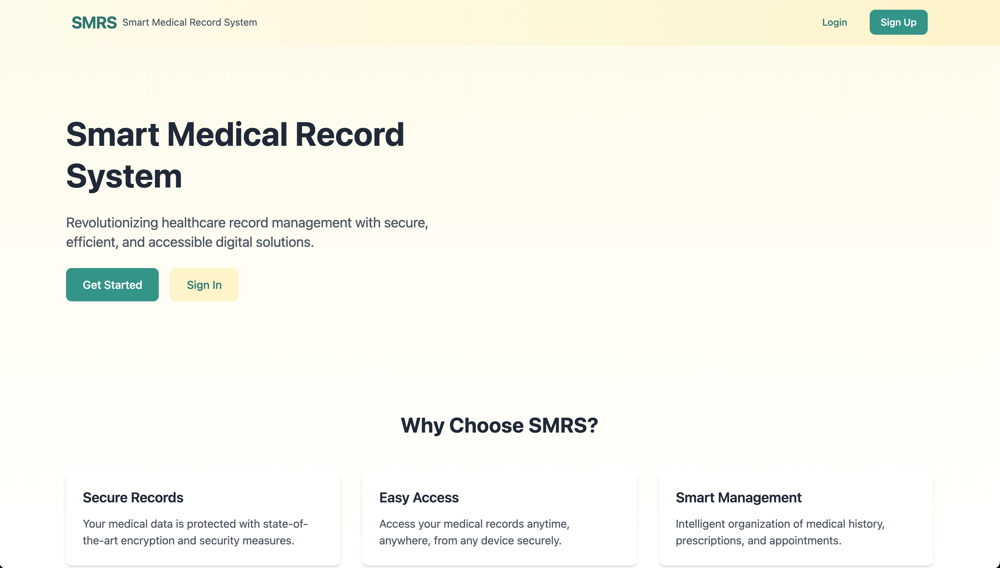
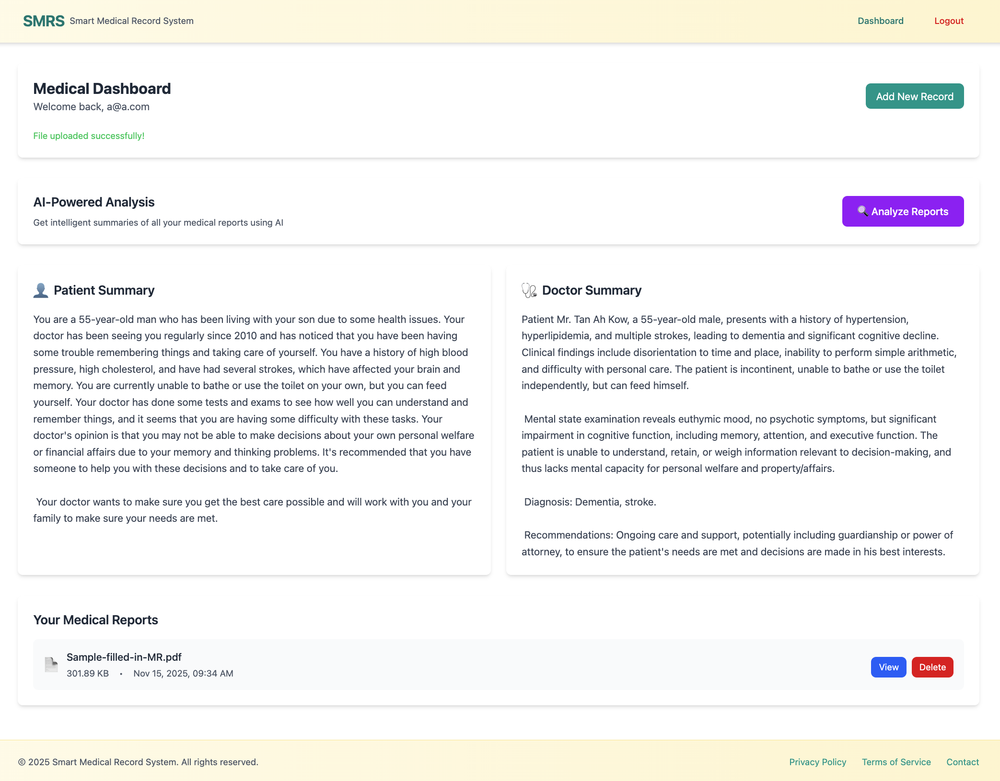

# Smart Medical Record System – Frontend 

* The frontend for the Smart Medical Record System (SMRS) is built using **React + Vite**, allowing users to upload, view, and manage their medical PDFs.  
* This client communicates with the backend API deployed on Render.
<div align="center">
  
  
</div>
## Environment Variables

Create `frontend/.env` and set:

- `VITE_API_URL`: existing backend URL (upload/delete/original analyze flow)
- `VITE_ANALYZE_API_URL`: public report analysis backend URL
- Firebase keys used in `src/Firebase.js`

Example values are in `frontend/.env.example`.

This template provides a minimal setup to get React working in Vite with HMR and some ESLint rules.


---

## 🚀 Features
- User authentication (Firebase)
- Upload PDF files
- Fetch & display uploaded records
- View PDF previews
- Responsive UI
- Environment variable support
- Deployed on Netlify/Vercel

---

## 🧩 Tech Stack
- **React (Vite)**
- **Firebase Auth**
- **TailwindCSS / CSS**
- **Vercel / Netlify**

---

## 📂 Project Structure

```
medical-frontend/
├── src/
│   ├── components/
│   │   ├── Dashboard.jsx        # Main upload dashboard
│   │   └── Navbar.jsx           # Navigation bar
│   │
│   ├── context/
│   │   └── AuthContext.jsx      # Firebase auth wrapper
│   │
│   ├── pages/
│   │   ├── Login.jsx
│   │   └── Register.jsx
│   │
│   ├── firebase.js              # Firebase initialization
│   ├── App.jsx
│   └── main.jsx
│
├── public/
│   └── index.html
│
├── .env                         # Frontend environment variables
├── package.json
├── package-lock.json
├── vite.config.js
└── README.md
```

---

## 🔧 Setup Instructions

### 1. Clone the repo
```bash
git clone https://github.com/IIKirito-kunII/medical-frontend
cd medical-frontend
```

### 2. Install dependencies
```bash
npm install
```

### 3. Add `.env` with backend URL
```
VITE_API_URL=https://medical-backend-11qg.onrender.com
VITE_FIREBASE_API_KEY=xxxx
VITE_FIREBASE_AUTH_DOMAIN=xxxx
VITE_FIREBASE_PROJECT_ID=xxxx
VITE_FIREBASE_STORAGE_BUCKET=xxxx
VITE_FIREBASE_APP_ID=xxxx
```

### 4. Run app
```bash
npm run dev
```

---

## 🌐 Live Deployment
Frontend URL:  
🔗 **https://medical-frontend-three.vercel.app**

---

## 📜 License
This project is licensed under the MIT License – see the [LICENSE](LICENSE) file for details.

